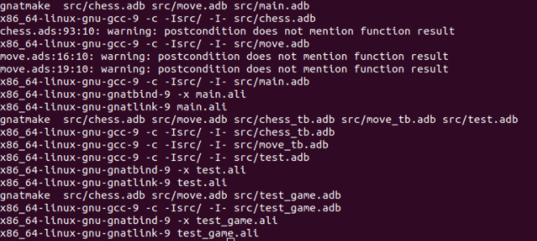

Adachess
========

Adachess is a simple console chess game developed in ada.

Getting Started
---------------

These instructions will allow you to get a copy of Adachess on your local machine. See Deployment for notes on how to deploy the project to a live system.

### Prerequisites

For Adachess to work, you will be asked to first install GNAT Community on your machine. You will be able to download the version corresponding to your machine on this link (https://www.adacore.com/download).

### Installing

Once GNAT Community is installed, you will need to follow the following instructions depending on your environment.

#### Linux

On Linux, please go to the adachess folder first, then start the compilation of the binary using the makefile available at root.

```shell
~$ cd adachess
adachess$ make

```

Once the make command is run, you should get the result below.



Control
-------

Below is the list of possible controls of Adachess.

- To **move** a piece, please enter the piece coordinates then the displacement coordinates (example: `a2a4`).
- To cast **kingside castling**, please enter `O-O`.
- To cast **queenside castling**, please enter `O-O-O`.
- To **load** a game, please enter `load` followed by the FEN of your game (example: `load rnbqkbnr/pppppppp/8/8/8/8/PPPPPPPP/RNBQKBNR w KQkq - 0 1`).
- To **save** a game, please enter `save` which will show you the window corresponds to the part.
- To **exit** a game, please enter `exit` which will end the current game.
- For **help**, please type `help` or` h` which will show you the list of available controls.

Running the tests
-----------------

FIXME

Built With
----------

- GNAT Community - Used to program in ada

Authors
-------

- Ianis Borne
- Arthus Leroy
- Brice Phelisse

TODO
----

chess board..................[0]  
basic rule...................[0]  
basic rule...................[0]  
advanced move................[0]  
advanced rule................[0]  
graphical interface..........[X]  
graphical move highlight.....[X]  
button command...............[X]  
